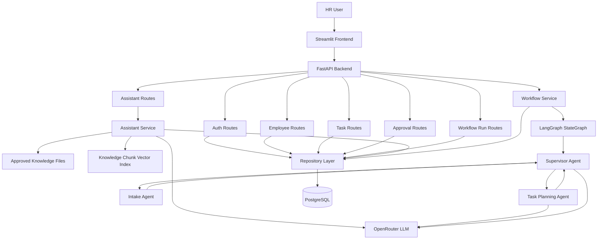
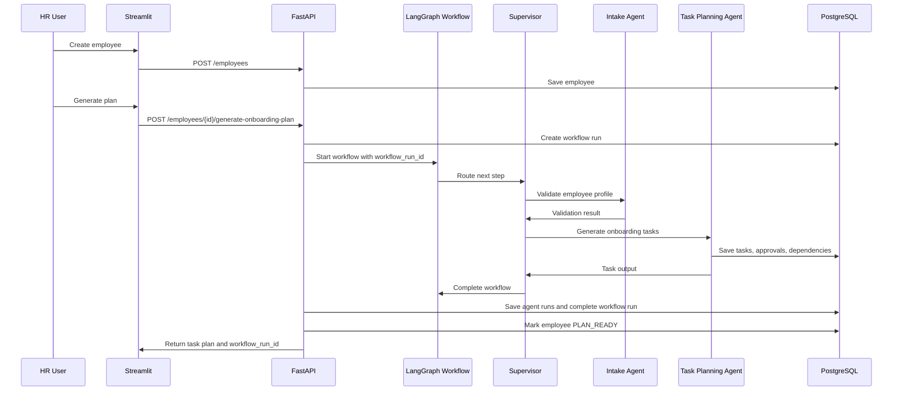
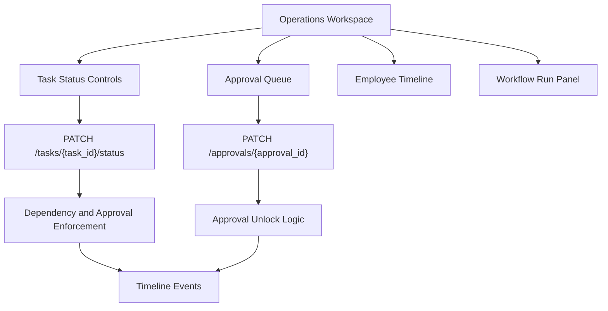
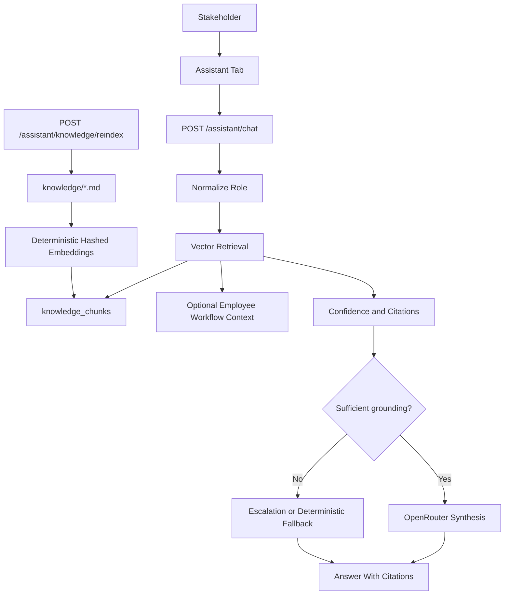

# Architecture Diagram

## Component View

```mermaid
flowchart TD
    HR["HR User"] --> UI["Streamlit Frontend"]
    UI --> API["FastAPI Backend"]
    API --> Auth["Auth Routes"]
    API --> Employees["Employee Routes"]
    API --> Tasks["Task Routes"]
    API --> Approvals["Approval Routes"]
    API --> Runs["Workflow Run Routes"]
    API --> Assistant["Assistant Routes"]
    Assistant --> AssistantService["Assistant Service"]
    AssistantService --> Knowledge["Approved Knowledge Files"]
    AssistantService --> VectorIndex["Knowledge Chunk Vector Index"]
    AssistantService --> LLM
    API --> Service["Workflow Service"]
    Service --> Graph["LangGraph StateGraph"]
    Graph --> Supervisor["Supervisor Agent"]
    Supervisor --> Intake["Intake Agent"]
    Intake --> Supervisor
    Supervisor --> Planner["Task Planning Agent"]
    Planner --> Supervisor
    Planner --> LLM["OpenRouter LLM"]
    Supervisor --> LLM
    Auth --> Repos
    Employees --> Repos["Repository Layer"]
    Tasks --> Repos
    Approvals --> Repos
    Runs --> Repos
    AssistantService --> Repos
    Service --> Repos
    Repos --> DB[("PostgreSQL")]
```

## Workflow Sequence

```mermaid
sequenceDiagram
    participant HR as HR User
    participant UI as Streamlit
    participant API as FastAPI
    participant WF as LangGraph Workflow
    participant S as Supervisor
    participant I as Intake Agent
    participant T as Task Planning Agent
    participant DB as PostgreSQL

    HR->>UI: Create employee
    UI->>API: POST /employees
    API->>DB: Save employee
    HR->>UI: Generate plan
    UI->>API: POST /employees/{id}/generate-onboarding-plan
    API->>DB: Create workflow run
    API->>WF: Start workflow with workflow_run_id
    WF->>S: Route next step
    S->>I: Validate employee profile
    I->>S: Validation result
    S->>T: Generate onboarding tasks
    T->>DB: Save tasks, approvals, dependencies
    T->>S: Task output
    S->>WF: Complete workflow
    API->>DB: Save agent runs and complete workflow run
    API->>DB: Mark employee PLAN_READY
    API->>UI: Return task plan and workflow_run_id
```

## Operations Flow

```mermaid
flowchart TD
    Ops["Operations Workspace"] --> Queue["Approval Queue"]
    Ops --> Status["Task Status Controls"]
    Ops --> Timeline["Employee Timeline"]
    Ops --> RunPanel["Workflow Run Panel"]
    Queue --> ApprovalAPI["PATCH /approvals/{approval_id}"]
    Status --> TaskAPI["PATCH /tasks/{task_id}/status"]
    TaskAPI --> Rules["Dependency and Approval Enforcement"]
    ApprovalAPI --> Unlock["Approval Unlock Logic"]
    Rules --> Audit["Timeline Events"]
    Unlock --> Audit
```

## Assistant Retrieval Flow

```mermaid
flowchart TD
    User["Stakeholder"] --> UI["Assistant Tab"]
    UI --> Chat["POST /assistant/chat"]
    Chat --> Role["Normalize Role"]
    Role --> Retrieve["Vector Retrieval"]
    Retrieve --> Chunks["knowledge_chunks"]
    Retrieve --> Context["Optional Employee Workflow Context"]
    Retrieve --> Score["Confidence and Citations"]
    Score --> Decision{"Sufficient grounding?"}
    Decision -->|Yes| LLM["OpenRouter Synthesis"]
    Decision -->|No| Fallback["Escalation or Deterministic Fallback"]
    LLM --> Response["Answer With Citations"]
    Fallback --> Response
    Reindex["POST /assistant/knowledge/reindex"] --> Files["knowledge/*.md"]
    Files --> Embed["Deterministic Hashed Embeddings"]
    Embed --> Chunks
```
