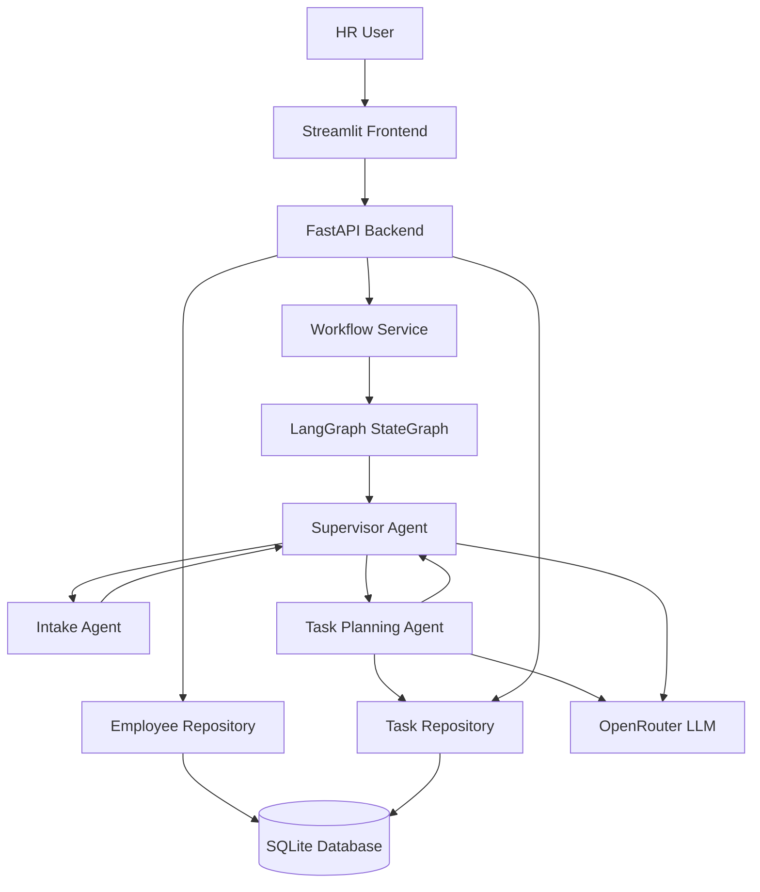
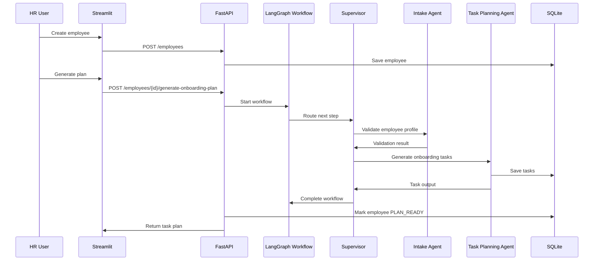

# Architecture Diagram

```mermaid
flowchart TD
    HR["HR User"] --> UI["Streamlit Frontend"]
    UI --> API["FastAPI Backend"]
    API --> Service["Workflow Service"]
    Service --> Graph["LangGraph StateGraph"]
    Graph --> Supervisor["Supervisor Agent"]
    Supervisor --> Intake["Intake Agent"]
    Intake --> Supervisor
    Supervisor --> Planner["Task Planning Agent"]
    Planner --> Supervisor
    Planner --> Tasks["Task Repository"]
    API --> Employees["Employee Repository"]
    API --> Tasks
    Employees --> DB[("SQLite Database")]
    Tasks --> DB
    Planner --> LLM["OpenRouter LLM"]
    Supervisor --> LLM
```

## Current Phase 1 Flow

```mermaid
sequenceDiagram
    participant HR as HR User
    participant UI as Streamlit
    participant API as FastAPI
    participant WF as LangGraph Workflow
    participant S as Supervisor
    participant I as Intake Agent
    participant T as Task Planning Agent
    participant DB as SQLite

    HR->>UI: Create employee
    UI->>API: POST /employees
    API->>DB: Save employee
    HR->>UI: Generate plan
    UI->>API: POST /employees/{id}/generate-onboarding-plan
    API->>WF: Start workflow
    WF->>S: Route next step
    S->>I: Validate employee profile
    I->>S: Validation result
    S->>T: Generate onboarding tasks
    T->>DB: Save tasks
    T->>S: Task output
    S->>WF: Complete workflow
    API->>DB: Mark employee PLAN_READY
    API->>UI: Return task plan
```
